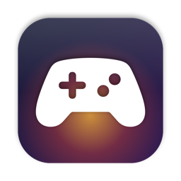
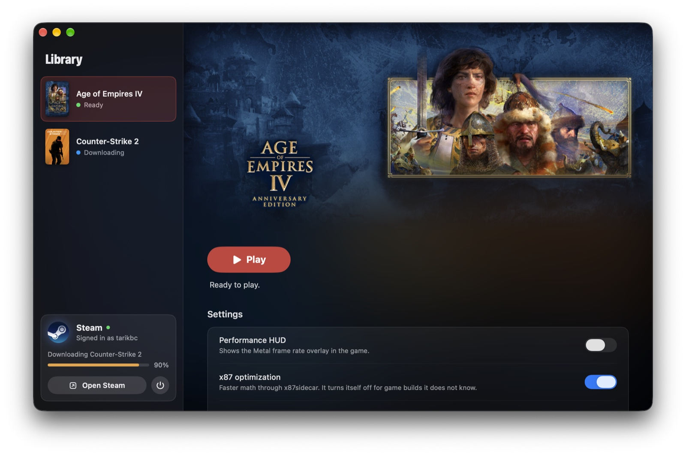
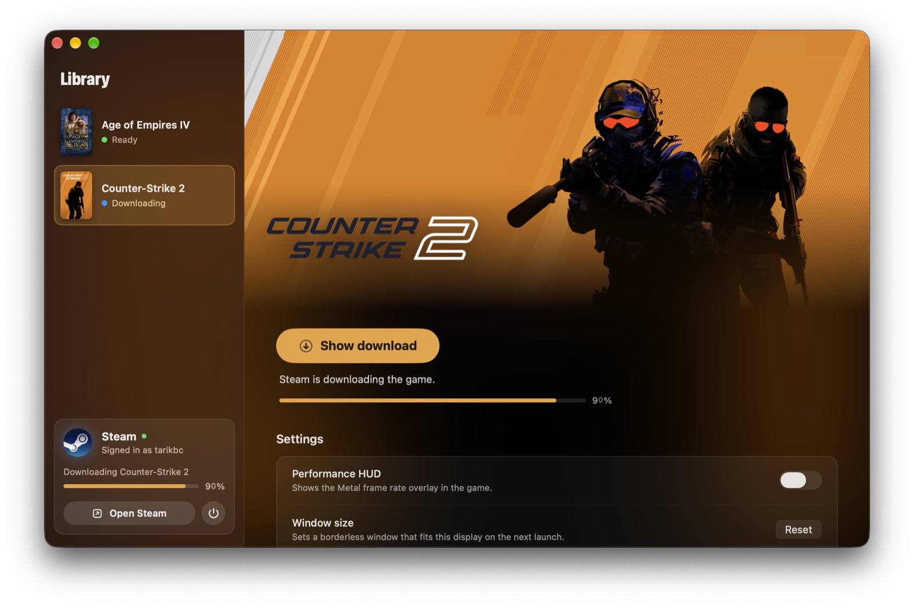

<p align="center">
  
</p>

<h1 align="center">MacGames</h1>

<p align="center">
  Play your Windows games from Steam on an Apple Silicon Mac.<br>
  One shared Steam, with graphics and performance settings tuned for each game.
</p>

<p align="center">
  <a href="LICENSE"></a>
  
  
  
</p>

<p align="center">
  
</p>

## What it does

- **Sets up everything for you.** One click installs a Windows environment, the graphics libraries and
  the official Steam client. You sign in with your own account and install games the usual way.
- **One Steam for every game.** All games share one Steam client and one library, so you sign in once.
- **Tuned per game.** Each game gets the renderer that works best for it: Apple D3DMetal for
  Age of Empires IV, and DXMT with shader pre-compilation for Counter-Strike 2.
- **Faster x87 math for Age of Empires IV.** On the exact game build it was made for, the game runs
  under [x87sidecar](https://github.com/athei/x87sidecar), a JIT that replaces Rosetta's slow x87
  translation. Any other build falls back to standard Wine on its own.
- **Kept apart from your Mac.** The Windows environment has no links into your home folder.
- **Made for more games.** Adding a game is one profile in code. The library, artwork and setup follow.

## Supported games

| Game | Renderer | Status |
|---|---|---|
| Age of Empires IV | Apple D3DMetal, x87sidecar optimization | Tested, runs on an M3 Max |
| Counter-Strike 2 | DXMT with early shader compile | Tested, reaches the main menu on an M3 Max |

You need to own each game on Steam. MacGames never includes or downloads games itself.

## Requirements

- A Mac with Apple Silicon (M1 or later)
- macOS 26 or later
- Rosetta 2 (MacGames tells you how to install it if it is missing)
- About 3 GB for the shared environment, plus the size of your games

## Build and run

MacGames is not distributed as a ready-made app yet. You build it with Xcode.

1. Install **Xcode 27** and **XcodeGen** (`brew install xcodegen`).
2. Get the runtime. MacGames reuses the open-licensed Wine engine, DXMT and x87sidecar binaries from the
   free a prebuilt alpha app. Install the runtime package, then run:

   ```sh
   scripts/fetch-runtime.sh
   ```

   This copies the parts MacGames uses, with their source code and licenses, into `Vendor/`. You can
   remove the runtime package afterwards.
3. Build and open the app:

   ```sh
   xcodegen generate
   xcodebuild -project MacGames.xcodeproj -scheme MacGames -configuration Release \
     -derivedDataPath build/DerivedData build
   open build/DerivedData/Build/Products/Release/MacGames.app
   ```

## Using MacGames

1. Select a game and choose **Set up**. This takes about a minute the first time.
2. Steam opens. Sign in, then install the game and keep the default folder.
3. Choose **Play**. The Steam card in the sidebar shows downloads and lets you open or stop Steam.

<p align="center">
  
</p>

Settings for each game are on its page: the Metal performance HUD, the x87 optimization for
Age of Empires IV, and a window size reset for Counter-Strike 2.

Everything also works from the command line, which helps with scripts and bug reports:

```sh
MacGames.app/Contents/MacOS/MacGames --command status --game aoe4
```

Commands: `check`, `setup`, `steam`, `install`, `play`, `stop`, `status`, `reset-display`, and
`settings --optimized on|off --hud on|off`.

## How it works

```
MacGames.app
 ├─ sets up   ~/Library/Application Support/macgames/steam
 │             ├─ deps/Frameworks   libraries and D3DMetal (downloaded, hash checked)
 │             ├─ engine            Wine 11 + DXMT + controller overlays
 │             ├─ prefix            Windows environment with the shared Steam
 │             └─ games/<id>        per-game settings and shader caches
 └─ starts    wine steam.exe -applaunch <app id>   with that game's environment
                └─ Steam starts the game (x86-64, under Rosetta 2)
                     └─ Age of Empires IV only: MacGamesBridge → x87sidecar
```

Steam hands its own environment to every game it starts. Because the games need different renderers,
MacGames restarts Steam with the right settings before a launch when needed. It never restarts Steam
while a game runs, and opening Steam never interrupts a download.

More detail is in [CONTRIBUTING.md](CONTRIBUTING.md#how-the-code-is-organized).

## Questions

**The game shows a message about the video card driver.** This is normal with Wine. Choose **OK**.

**Is online play safe?** Counter-Strike 2 runs with VAC on, like on Windows. Valve has no official
statement about Wine on macOS, so play online at your own risk.

**Where are the logs?** Choose **Logs** in a game's settings, or open
`~/Library/Application Support/macgames/steam/logs`.

**Can I add a game?** Yes. See [Adding a game](CONTRIBUTING.md#adding-a-game). Please open a
[game request](../../issues/new/choose) first, so others can help test it.

## Contributing

Bug reports, test results from other Macs, and new game profiles are very welcome.
Read [CONTRIBUTING.md](CONTRIBUTING.md) to get started, and please follow the
[code of conduct](CODE_OF_CONDUCT.md).

## License

MacGames is **free for non-commercial use** under the
[PolyForm Noncommercial License 1.0.0](LICENSE). You may use, change and share it for personal use,
hobby projects, research, education, and in charities and public institutions.

You may **not** sell MacGames, include it in a paid product, or use it in any other commercial way.
This makes MacGames source-available rather than "open source" in the OSI sense. For commercial
licensing, open an issue or contact [@tarikbc](https://github.com/tarikbc).

Third-party components keep their own licenses. Wine stays LGPL, and x87sidecar and DXMT stay MIT.
See [THIRD_PARTY_NOTICES.md](THIRD_PARTY_NOTICES.md).

## Credits

MacGames stands on the work of many projects:

- [Wine](https://www.winehq.org) and [CodeWeavers](https://www.codeweavers.com), whose CrossOver
  source the engine is built from
- a prebuilt, which made the patched engine and the game recipes this
  project learned from
- [x87sidecar](https://github.com/athei/x87sidecar), based on
  [rosettax87_jit](https://github.com/Lifeisawful/rosettax87_jit)
- [DXMT](https://github.com/3Shain/dxmt) by Feifan He
- [Sikarugir](https://github.com/Sikarugir-App), which packages the libraries and Apple's D3DMetal
- Apple's Game Porting Toolkit

MacGames is not affiliated with Valve, Microsoft, Apple, CodeWeavers or the makers of the runtime package.
Game names and artwork belong to their owners.
