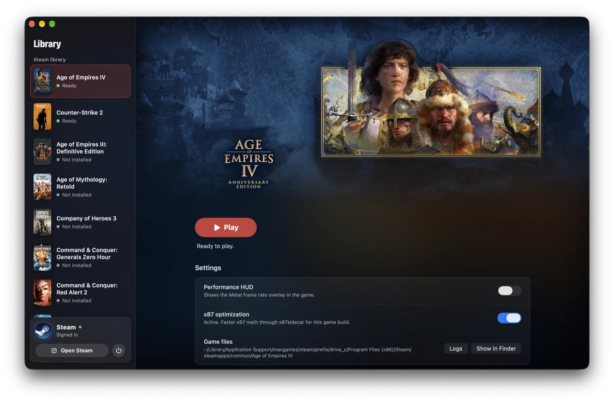
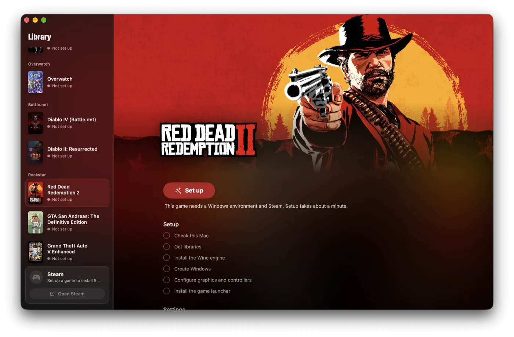

<p align="center">
  
</p>

<h1 align="center">MacGames</h1>

<p align="center">
  Play your Windows games from Steam and Battle.net on an Apple Silicon Mac.<br>
  Twenty games, each with graphics and performance settings tuned for it.
</p>

<p align="center">
  <a href="https://macgames.app/"><b>Website</b></a> ·
  <a href="https://github.com/tarikbc/macgames/releases/latest"><b>Download</b></a>
</p>

<p align="center">
  <a href="LICENSE"></a>
  
  
  
</p>

<p align="center">
  
</p>

## What it does

- **Sets up everything for you.** One click installs a Windows environment, the graphics libraries and
  the official Steam client. You sign in with your own account and install games the usual way.
- **One Steam for every game.** All games share one Steam client and one library, so you sign in once.
- **Tuned per game.** Each game gets the renderer that works best for it: Apple D3DMetal for
  Age of Empires IV, and DXMT with shader pre-compilation for Counter-Strike 2.
- **Overwatch on Recall's engine.** Overwatch runs on the Wine and DXMT build of
  [Recall](https://github.com/AsherJN/recall), with its fullscreen canvas, raw mouse input, macOS Game
  Mode and graphics pipelines prepared before each session. Battle.net starts the game when you choose Play.
- **Faster x87 math for Age of Empires IV.** On the exact game build it was made for, the game runs
  under [x87sidecar](https://github.com/athei/x87sidecar), a JIT that replaces Rosetta's slow x87
  translation. Any other build falls back to standard Wine on its own.
- **Kept apart from your Mac.** The Windows environment has no links into your home folder.
- **Made for more games.** Adding a game is one profile in code. The library, artwork and setup follow.

## Supported games

| Game | Environment | Renderer | Status |
|---|---|---|---|
| [Age of Empires IV](https://macgames.app/games/age-of-empires-iv/) | Steam library | D3DMetal, x87sidecar optimization | Tested on an M3 Max |
| [Counter-Strike 2](https://macgames.app/games/counter-strike-2/) | Steam library | DXMT with early shader compile | Tested, reaches the main menu |
| [Age of Empires III: Definitive Edition](https://macgames.app/games/age-of-empires-iii-definitive-edition/) | Steam library | D3DMetal | Imported |
| [Age of Mythology: Retold](https://macgames.app/games/age-of-mythology-retold/) | Steam library | D3DMetal, notch-safe fullscreen | Imported |
| [Company of Heroes 3](https://macgames.app/games/company-of-heroes-3/) | Steam library | D3DMetal, Microsoft UCRT for multiplayer | Imported |
| [Command & Conquer: Generals Zero Hour](https://macgames.app/games/command-and-conquer-generals-zero-hour/) | Steam library | Wine D3D8, GeneralsOnline for online play | Imported |
| [Command & Conquer: Red Alert 2](https://macgames.app/games/command-and-conquer-red-alert-2/) | Steam library | cnc-ddraw, CnCNet for online play | Imported |
| [Heroes of Might and Magic III](https://macgames.app/games/heroes-of-might-and-magic-iii/) | Steam library | cnc-ddraw, sound fix | Imported |
| [Diablo IV](https://macgames.app/games/diablo-iv/) | Steam library | D3DMetal | Imported |
| [Path of Exile 2](https://macgames.app/games/path-of-exile-2/) | Steam library | D3DMetal, DirectX 12 | Imported |
| [Hogwarts Legacy](https://macgames.app/games/hogwarts-legacy/) | Steam library | D3DMetal | Imported |
| [The Witcher 3: Wild Hunt](https://macgames.app/games/the-witcher-3-wild-hunt/) | Steam library | D3DMetal, FidelityFX proxy | Imported |
| [Elden Ring](https://macgames.app/games/elden-ring/) | Steam library | D3DMetal, offline play only | Imported |
| [The Elder Scrolls V: Skyrim Special Edition](https://macgames.app/games/skyrim-special-edition/) | Skyrim | DXMT 0.72 | Imported |
| [Overwatch](https://macgames.app/games/overwatch/) | Overwatch | Recall 1.1's Wine and DXMT, through Battle.net | Imported |
| [Diablo IV (Battle.net)](https://macgames.app/games/diablo-iv-battle-net/) | Battle.net | D3DMetal, DXMT for the client | Imported |
| [Diablo II: Resurrected](https://macgames.app/games/diablo-ii-resurrected/) | Battle.net | D3DMetal, DXMT for the client | Imported |
| [Red Dead Redemption 2](https://macgames.app/games/red-dead-redemption-2/) | Rockstar | D3DMetal, WineD3D for the Rockstar launcher | Imported |
| [GTA San Andreas: The Definitive Edition](https://macgames.app/games/gta-san-andreas-definitive-edition/) | Rockstar | D3DMetal, WineD3D for the Rockstar launcher | Imported |
| [Grand Theft Auto V Enhanced](https://macgames.app/games/gta-v-enhanced/) | GTA V | Wine 11.13, D3DMetal 4.0b2, story mode only | Imported |

"Imported" means the game has a full recipe in MacGames but has not been tested in this app yet. Test
reports are very welcome. You need to own each game. MacGames never includes or downloads games itself.

**Environments.** Most games share one Steam client in the Steam library. A game gets its own Windows
environment, with its own Steam or Battle.net, when it needs a different engine or changes to Windows
that would break the others. Each environment downloads its extra parts on first setup.

**Online play.** Zero Hour and Red Alert 2 have a **Play Online** button that sets up and starts the
community clients. Elden Ring runs offline only, and GTA V runs story mode only. Online play with
anti-cheat is at your own risk.

## Requirements

- A Mac with Apple Silicon (M1 or later)
- macOS 26 or later
- Rosetta 2 (MacGames tells you how to install it if it is missing)
- About 3 GB for the shared environment, plus the size of your games

## Install

Download `MacGames-<version>.dmg` from the [latest release](../../releases/latest), open it, and
drag MacGames into Applications. The app is signed with a Developer ID and notarized by Apple.
MacGames checks for updates itself; you can also choose **MacGames > Check for Updates…**.

## Build and run

To build MacGames yourself, use Xcode.

1. Install **Xcode 27** and **XcodeGen** (`brew install xcodegen`).
2. Get the runtime: the Wine engine, DXMT and x87sidecar, with their source code and licenses.

   ```sh
   scripts/fetch-runtime.sh
   ```

   This downloads the runtime archive (about 125 MB) from this repository's
   [releases](../../releases), checks its SHA-256 and signatures, and unpacks it into `Vendor/`.
3. Build and open the app:

   ```sh
   xcodegen generate
   xcodebuild -project MacGames.xcodeproj -scheme MacGames -configuration Release \
     -derivedDataPath build/DerivedData build
   open build/DerivedData/Build/Products/Release/MacGames.app
   ```

## Using MacGames

1. Select a game and choose **Set up**. This takes about a minute the first time.
2. Steam opens. Sign in, then install the game and keep the default folder.
3. Choose **Play**. The Steam card in the sidebar shows downloads and lets you open or stop Steam.

<p align="center">
  
</p>

Settings for each game are on its page: the Metal performance HUD, the x87 optimization for
Age of Empires IV, and a window size reset for Counter-Strike 2.

**Uninstall** on a game's page deletes its files and keeps your saves and settings. When no game
of a group is installed any more, **Remove setup** deletes that group's launcher and Windows files.

Everything also works from the command line, which helps with scripts and bug reports:

```sh
MacGames.app/Contents/MacOS/MacGames --command status --game aoe4
```

Commands: `check`, `setup`, `steam`, `install`, `play`, `stop`, `uninstall`, `remove-setup`, `status`,
`reset-display`, and `settings --optimized on|off --hud on|off`.

## How it works

```
MacGames.app
 ├─ sets up   ~/Library/Application Support/macgames/steam
 │             ├─ deps/Frameworks   libraries and D3DMetal (downloaded, hash checked)
 │             ├─ engine            Wine 11 + DXMT + controller overlays
 │             ├─ prefix            Windows environment with the shared Steam
 │             └─ games/<id>        per-game settings and shader caches
 └─ starts    wine steam.exe -applaunch <app id>   with that game's environment
                └─ Steam starts the game (x86-64, under Rosetta 2)
                     └─ Age of Empires IV only: MacGamesBridge → x87sidecar
```

Steam hands its own environment to every game it starts. Because the games need different renderers,
MacGames restarts Steam with the right settings before a launch when needed. It never restarts Steam
while a game runs, and opening Steam never interrupts a download.

More detail is in [CONTRIBUTING.md](CONTRIBUTING.md#how-the-code-is-organized).

## Questions

**The game shows a message about the video card driver.** This is normal with Wine. Choose **OK**.

**Is online play safe?** Counter-Strike 2 runs with VAC on, like on Windows. Valve has no official
statement about Wine on macOS, so play online at your own risk.

**Where are the logs?** Choose **Logs** in a game's settings, or open
`~/Library/Application Support/macgames/steam/logs`.

**Can I add a game?** Yes. See [Adding a game](CONTRIBUTING.md#adding-a-game). Please open a
[game request](../../issues/new/choose) first, so others can help test it.

## Contributing

Bug reports, test results from other Macs, and new game profiles are very welcome.
Read [CONTRIBUTING.md](CONTRIBUTING.md) to get started, and please follow the
[code of conduct](CODE_OF_CONDUCT.md).

## License

MacGames is **free for non-commercial use** under the
[PolyForm Noncommercial License 1.0.0](LICENSE). You may use, change and share it for personal use,
hobby projects, research, education, and in charities and public institutions.

You may **not** sell MacGames, include it in a paid product, or use it in any other commercial way.
This makes MacGames source-available rather than "open source" in the OSI sense. For commercial
licensing, open an issue or contact [@tarikbc](https://github.com/tarikbc).

Third-party components keep their own licenses. Wine stays LGPL, and x87sidecar and DXMT stay MIT.
See [THIRD_PARTY_NOTICES.md](THIRD_PARTY_NOTICES.md).

## Credits

MacGames stands on these open-source projects:

- [Wine](https://www.winehq.org), and the open-source release of CrossOver by
  [CodeWeavers](https://www.codeweavers.com) that the engine is built from
- [x87sidecar](https://github.com/athei/x87sidecar), based on
  [rosettax87_jit](https://github.com/Lifeisawful/rosettax87_jit)
- [DXMT](https://github.com/3Shain/dxmt) by Feifan He
- [Sikarugir](https://github.com/Sikarugir-App), which packages the libraries MacGames downloads
- [SDL](https://www.libsdl.org), for game controllers
- [cnc-ddraw](https://github.com/FunkyFr3sh/cnc-ddraw) by FunkyFr3sh, for Heroes III and Red Alert 2
- [witcher3-crossover-fix](https://github.com/tholtman1-del/witcher3-crossover-fix), the Witcher 3 FidelityFX proxy
- [CnCNet](https://github.com/CnCNet), the Red Alert 2 online client
- [EldenRingEacToggler](https://github.com/techiew/EldenRingEacToggler), for the offline Elden Ring start
- [.NET](https://github.com/dotnet), which the CnCNet client runs on

MacGames is not affiliated with Valve, Microsoft, Apple or CodeWeavers.
Game names and artwork belong to their owners.
